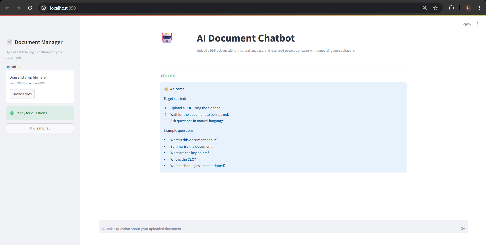
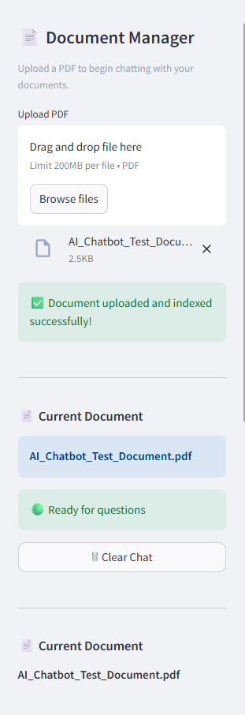
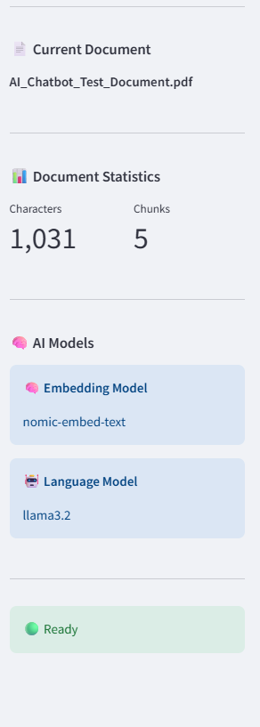
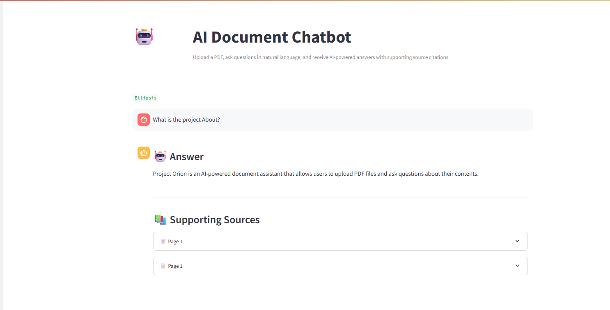
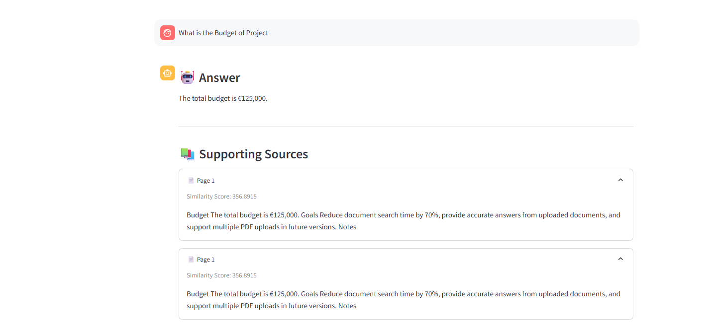
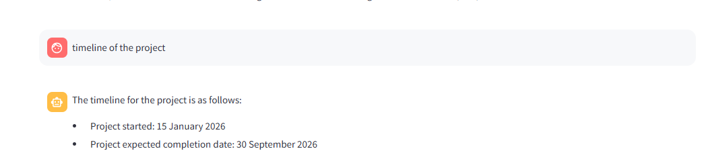

# 🤖 AI Document Chatbot

An AI-powered document chatbot that allows users to upload PDF documents and ask questions using **Retrieval-Augmented Generation (RAG)**.

The application extracts text from PDFs, generates vector embeddings with Ollama, stores them in ChromaDB, retrieves the most relevant information and uses a Large Language Model to generate contextual answers.

---

## ✨ Features

- 📄 Upload PDF documents
- 🤖 Ask questions in natural language
- 🔍 Semantic search using vector embeddings
- 📚 Source citations with page references
- ⚡ FastAPI backend
- 🎨 Streamlit frontend
- 🧠 Ollama LLM integration
- 💾 ChromaDB vector database
- 📑 Automatic text chunking
- 🔎 Similarity search retrieval

---

## 🏗️ Architecture

```text
                PDF Upload
                     │
                     ▼
          PDF Text Extraction
                     │
                     ▼
             Text Chunking
                     │
                     ▼
     nomic-embed-text Embeddings
                     │
                     ▼
               ChromaDB
                     │
                     ▼
         Similarity Search
                     │
                     ▼
          Retrieved Context
                     │
                     ▼
          Ollama (llama3.2)
                     │
                     ▼
             AI Response
```

---

## 🛠️ Tech Stack

| Technology | Purpose |
|------------|---------|
| Python | Programming Language |
| FastAPI | Backend API |
| Streamlit | Frontend |
| LangChain | RAG Pipeline |
| ChromaDB | Vector Database |
| Ollama | Local LLM Runtime |
| llama3.2 | Language Model |
| nomic-embed-text | Embedding Model |
| PyPDF | PDF Text Extraction |

---

## 📂 Project Structure

```text
ai-chatbot-flowise/

├── app/
│   ├── api/
│   ├── chatbot/
│   ├── database/
│   └── services/
│
├── frontend/
│   └── streamlit_app.py
│
├── documents/
├── chroma_db/
├── requirements.txt
└── README.md
```

---

## 🚀 Installation

### Clone the repository

```bash
git clone https://github.com/YOUR_USERNAME/ai-chatbot-flowise.git
cd ai-chatbot-flowise
```

### Create a virtual environment

```bash
python -m venv .venv
```

### Activate the environment

Windows

```bash
.venv\Scripts\activate
```

Linux / macOS

```bash
source .venv/bin/activate
```

### Install dependencies

```bash
pip install -r requirements.txt
```

### Start Ollama

```bash
ollama serve
```

Pull the required models:

```bash
ollama pull llama3.2
ollama pull nomic-embed-text
```

### Run the FastAPI backend

```bash
uvicorn app.main:app --reload
```

### Run Streamlit

```bash
streamlit run frontend/streamlit_app.py
```

---

## 💬 Example Questions

- What is this document about?
- Summarise the document.
- What technologies are mentioned?
- Who is the CEO?
- What are the meeting notes?
- What is Project Phoenix?
- What security policies are described?

---

## 📸 Screenshots

Add screenshots here after capturing the application.









---

## 🔮 Future Improvements

- Multiple document support
- Conversation memory
- Hybrid search (BM25 + vector search)
- Streaming responses
- User authentication
- Docker deployment
- Cloud deployment
- Citation highlighting

---

## 📄 License

This project is licensed under the MIT License.